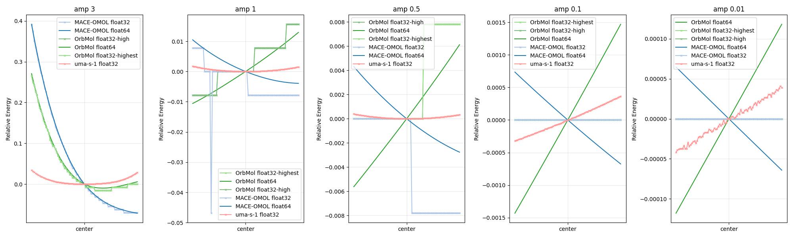
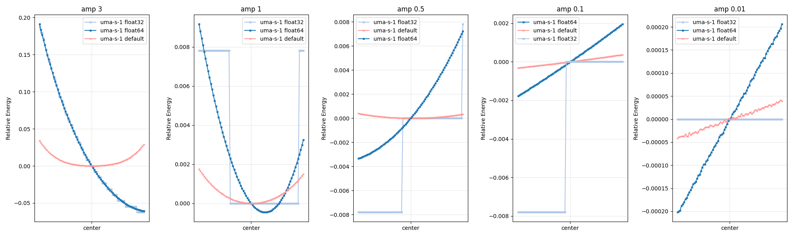
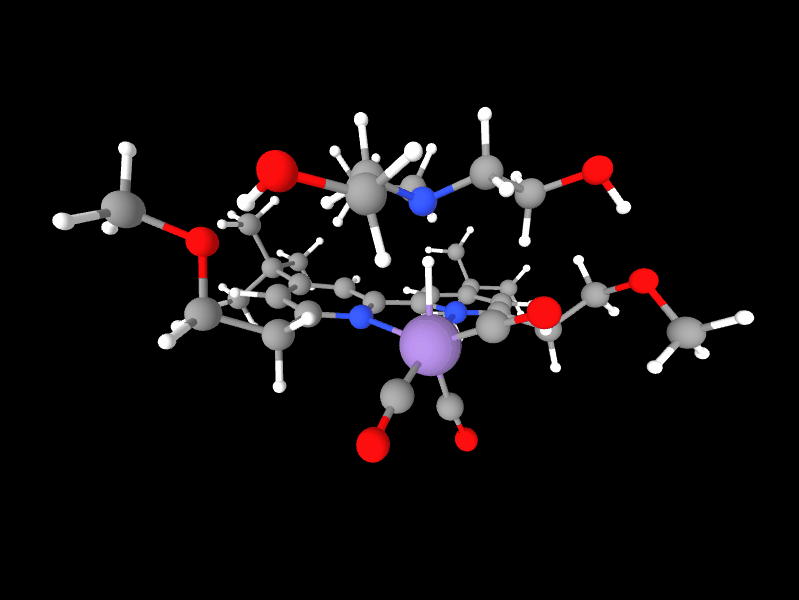

# Numerical Instability in MLIP: Precision Effects

## Overview
The notebook `numerical_instability.ipynb` describes an issue stemming from differences in the default precision settings across MLIP models. 

ASE performs numerical Hessian evaluations by applying slight displacements to atomic positions from the initial positions, resulting in very small energy differences.
When using low-precision data types (e.g., `float32`) to evaluate numerical gradients or Hessians, MLIPs can struggle with these subtle variations, leading to instability such as erratic trajectories or flatlined energy curves.

## Tests
I evaluated three MLIPs (`OrbMol`, `UMA-s-1.1`, and `MACE-OMOL`) under varying precision settings:
- **UMA-s-1.1**: Supports only `float32`
- **MACE-OMOL**: [`float64(default)`, `float32`]
- **OrbMol**: [`float64`, `float32-highest`, `float32-high`]



These tests highlight how precision mismatches exacerbate ASE's numerical approximation challenges.

Furthermore, when UMA evaluates with float64/float32 `dtypes`, it shows similar behavior to other models.

(The `ASE` implementation in `fairchem` doesn't allow flexible `dtype` settings, but the [`TorchSim`](https://github.com/TorchSim/torch-sim) interface does, so I wrapped it into an `ase.calculators.calculator` for these tests.)

The figure below indicates that `dtype` is crucial: using the same `dtype` guarantees similar behavior across models (e.g., `OrbMol`, `MACE-OMOL`).




<details>
  <summary>Example ASE Implementation</summary>

```python
from ase.calculators.calculator import Calculator, all_changes
import torch
import torch_sim as ts
from torch_sim.models.fairchem import FairChemModel
import numpy as np

class FairChemASECalculator(Calculator):
    """ASE Calculator wrapper for torch-sim's FairChemModel.

    This wrapper enables the use of torch-sim's FairChemModel within ASE,
    providing access to torch-sim's flexible dtype support and model capabilities.

    Args:
        model_path: Model name or checkpoint path (e.g., "uma-s-1p1", "EquiformerV2-31M-S2EF-OC20-All+MD")
        task_name: Task type for the model ("omat", "omol", or "oc20")
        cpu: Whether to use CPU (default: False if CUDA available, else True)
        dtype: torch dtype for computation (e.g., torch.float32, torch.float64)
        compute_stress: Whether to compute stress tensor
        **kwargs: Additional arguments passed to ASE Calculator

    Example:
        >>> from ase import Atoms
        >>> atoms = Atoms('H2O', positions=[[0,0,0], [1,0,0], [0,1,0]])
        >>> calc = FairChemASECalculator(
        ...     model_path="uma-s-1p1",
        ...     task_name="omol",
        ...     dtype=torch.float64
        ... )
        >>> atoms.calc = calc
        >>> energy = atoms.get_potential_energy()
        >>> forces = atoms.get_forces()
    """

    implemented_properties = ["energy", "forces", "stress"]

    def __init__(
        self,
        model_path: str,
        task_name: str,
        cpu: bool = (False if torch.cuda.is_available() else True),
        dtype: torch.dtype = torch.float64,
        compute_stress: bool = False,
        **kwargs
    ):
        super().__init__(**kwargs)

        # Initialize torch-sim FairChemModel with model name or path
        self.ts_model = FairChemModel(
            model=model_path,  # Pass model name or checkpoint path directly
            task_name=task_name,
            cpu=cpu,
            dtype=dtype,
            compute_stress=compute_stress
        )

        self.device = 'cpu' if cpu else 'cuda'
        self.dtype = dtype
        self.task_name = task_name

    def calculate(
        self,
        atoms=None,
        properties=["energy", "forces"],
        system_changes=all_changes
    ):
        """Calculate energy, forces, and optionally stress for the given atomic structure."""
        super().calculate(atoms, properties, system_changes)

        # For omol task, ensure charge and spin properties are set
        if self.task_name == "omol":
            if "charge" not in atoms.info:
                atoms.info["charge"] = 0  # Default: neutral molecule
            if "spin" not in atoms.info:
                atoms.info["spin"] = 1  # Default: singlet state

        # Convert ASE Atoms object to torch-sim SimState
        state = ts.io.atoms_to_state([atoms], self.device, self.dtype)

        # Run inference with torch-sim model
        results = self.ts_model(state)

        # Convert results to ASE format
        self.results["energy"] = results["energy"].item()
        self.results["forces"] = results["forces"].cpu().numpy()

        # Convert stress tensor if computed
        if "stress" in results and self.ts_model._compute_stress:
            stress_tensor = results["stress"][0].cpu().numpy()
            # Convert 3x3 tensor to Voigt notation 6-vector: xx, yy, zz, yz, xz, xy
            self.results["stress"] = np.array([
                stress_tensor[0, 0], stress_tensor[1, 1], stress_tensor[2, 2],
                stress_tensor[1, 2], stress_tensor[0, 2], stress_tensor[0, 1]
            ])
```

</details>

## Key Observations
- Despite operating exclusively in `float32`, `UMA-s-1.1` generates smoother energy curves compared to `OrbMol` or `MACE-OMOL` under `float32` precision. 
- `OrbMol` and `MACE-OMOL` show horizontal/discrete plot with `float32` precisions.

## Notes
1. `amp` represents the displacement weight, calculated as `mode_vector * amp`
2. Attached animation shows results at `amp=0.5` (vibrational trajectory with perturbations)


<p align="center">
  
</p>
